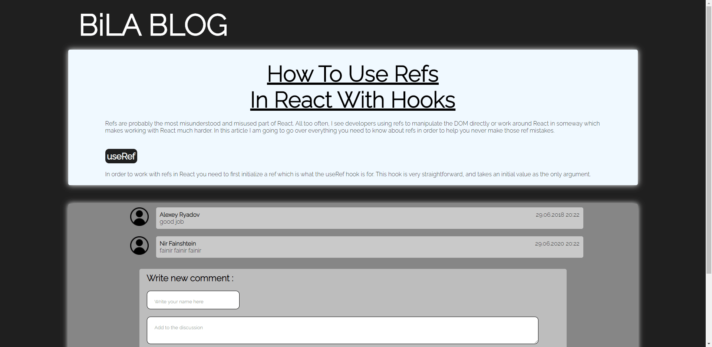

# My Blog Application

## Info

`Type` - Front-end

`Framework` - React.js

this app shows how to use the following correctly:

- useRef
- ErrorBoundary
- LazyLoading

## ErrorBoundary

To create the Error, I made a button that when clicked, triggers a function named `createError` that set in State `comments` an empty object.

```javascript
const createError = () => {
  setComments({});
};
```

> Why its create an Error ? ?

At the beginning of the component I defined the above state as an array:

```javascript
const [comments, setComments] = useState([]);
```

Later in the component, a map function is performed on the current state that only works on an array, and because I placed an object in the `comments`, an error is created.

```javascript
{
  comments.map((obj) => {
    return <SingleComment comment={obj} />;
  });
}
```

## Demo

https://my-blog-five-alpha.vercel.app/

## Simulation


